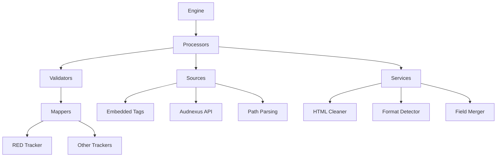

# 📚 Metadata Core Architecture Documentation

<div align="center">


**A comprehensive, modular metadata extraction and processing system for torrent creation workflows**

[🚀 Quick Start](#quick-start) • [📖 Documentation](#documentation-structure) • [🎯 Current Status](#current-status) • [🔧 Implementation](#implementation-guide)

</div>

---

## 🎯 Overview

The **Metadata Core** is a sophisticated, extensible system designed to extract, normalize, validate, and merge metadata from multiple sources for audiobook and media content. Built with modularity and testability in mind, it provides a clean separation between content processors, data sources, and utility services.

### ✨ Key Features

<div style="display: grid; grid-template-columns: repeat(auto-fit, minmax(300px, 1fr)); gap: 1rem; margin: 2rem 0;">

<div style="border: 1px solid #e1e5e9; border-radius: 8px; padding: 1.5rem; background: linear-gradient(135deg, #f8f9fa 0%, #ffffff 100%);">
<h3 style="margin-top: 0; color: #2d3748;">🔄 Multi-Source Merging</h3>
<p style="margin-bottom: 0; color: #4a5568;">Deterministic merging of embedded tags, API data, and path parsing with configurable precedence rules.</p>
</div>

<div style="border: 1px solid #e1e5e9; border-radius: 8px; padding: 1.5rem; background: linear-gradient(135deg, #f8f9fa 0%, #ffffff 100%);">
<h3 style="margin-top: 0; color: #2d3748;">🧩 Modular Architecture</h3>
<p style="margin-bottom: 0; color: #4a5568;">Clean separation of processors, sources, services, and validators for easy testing and extension.</p>
</div>

<div style="border: 1px solid #e1e5e9; border-radius: 8px; padding: 1.5rem; background: linear-gradient(135deg, #f8f9fa 0%, #ffffff 100%);">
<h3 style="margin-top: 0; color: #2d3748;">🎯 Tracker Integration</h3>
<p style="margin-bottom: 0; color: #4a5568;">Built-in support for RED tracker requirements with extensible mapper system for other trackers.</p>
</div>

<div style="border: 1px solid #e1e5e9; border-radius: 8px; padding: 1.5rem; background: linear-gradient(135deg, #f8f9fa 0%, #ffffff 100%);">
<h3 style="margin-top: 0; color: #2d3748;">🧪 Comprehensive Testing</h3>
<p style="margin-bottom: 0; color: #4a5568;">Unit tests for all components with integration tests ensuring end-to-end reliability.</p>
</div>

</div>

---

## 🚀 Quick Start

### Prerequisites
```bash
# Install core dependencies
pip install -e .[core,net]

# For development with all features
pip install -e .[core,net,strict,cli,test]
```

### Basic Usage
```python
from mk_torrent.core.metadata.engine import MetadataEngine

# Initialize the engine
engine = MetadataEngine()

# Process an audiobook
metadata = engine.process_audiobook("/path/to/audiobook.m4b")

# Validate for RED tracker
validation = engine.validate_for_tracker(metadata, "red")
```

---

## 📖 Documentation Structure

<div style="background: linear-gradient(135deg, #667eea 0%, #764ba2 100%); color: white; padding: 2rem; border-radius: 12px; margin: 2rem 0;">

### 🎭 Main Conductor
**[📋 __Metadata Core.md](./__Metadata Core.md)** - Master index and navigation hub for the entire architecture

</div>

### 📚 Detailed Specifications

<table style="width: 100%; border-collapse: collapse; margin: 2rem 0;">
<thead>
<tr style="background: #f8f9fa; border-bottom: 2px solid #dee2e6;">
<th style="padding: 1rem; text-align: left; border: 1px solid #dee2e6;">Section</th>
<th style="padding: 1rem; text-align: left; border: 1px solid #dee2e6;">Document</th>
<th style="padding: 1rem; text-align: left; border: 1px solid #dee2e6;">Description</th>
</tr>
</thead>
<tbody>

<tr style="background: #fff; border-bottom: 1px solid #dee2e6;">
<td style="padding: 1rem; border: 1px solid #dee2e6; font-weight: bold; color: #2d3748;">00</td>
<td style="padding: 1rem; border: 1px solid #dee2e6;">
<a href="./00 — Recommended Packages & Project Extras.md" style="color: #3182ce; text-decoration: none; font-weight: 500;">📦 Packages & Extras</a>
</td>
<td style="padding: 1rem; border: 1px solid #dee2e6; color: #4a5568;">Dependencies, optional enhancements, and project setup</td>
</tr>

<tr style="background: #f8f9fa; border-bottom: 1px solid #dee2e6;">
<td style="padding: 1rem; border: 1px solid #dee2e6; font-weight: bold; color: #2d3748;">01-04</td>
<td style="padding: 1rem; border: 1px solid #dee2e6;">
<a href="./01 — Goals.md" style="color: #3182ce; text-decoration: none;">🎯 Goals</a> •
<a href="./02 — High-level Architecture.md" style="color: #3182ce; text-decoration: none;">🏗️ Architecture</a> •
<a href="./03 — Proposed Directory Layout.md" style="color: #3182ce; text-decoration: none;">📁 Layout</a> •
<a href="./04 — Canonical Data Model.md" style="color: #3182ce; text-decoration: none;">📊 Data Model</a>
</td>
<td style="padding: 1rem; border: 1px solid #dee2e6; color: #4a5568;">Foundation and design principles</td>
</tr>

<tr style="background: #fff; border-bottom: 1px solid #dee2e6;">
<td style="padding: 1rem; border: 1px solid #dee2e6; font-weight: bold; color: #2d3748;">05-08</td>
<td style="padding: 1rem; border: 1px solid #dee2e6;">
<a href="./05 — Interfaces & Dependency Injection.md" style="color: #3182ce; text-decoration: none;">🔗 Interfaces</a> •
<a href="./06 — Engine Pipeline.md" style="color: #3182ce; text-decoration: none;">⚙️ Pipeline</a> •
<a href="./07 — Services Details.md" style="color: #3182ce; text-decoration: none;">🛠️ Services</a> •
<a href="./08 — Validators.md" style="color: #3182ce; text-decoration: none;">✅ Validators</a>
</td>
<td style="padding: 1rem; border: 1px solid #dee2e6; color: #4a5568;">Core components and processing logic</td>
</tr>

<tr style="background: #f8f9fa; border-bottom: 1px solid #dee2e6;">
<td style="padding: 1rem; border: 1px solid #dee2e6; font-weight: bold; color: #2d3748;">09-10</td>
<td style="padding: 1rem; border: 1px solid #dee2e6;">
<a href="./09 — Tracker Mapping.md" style="color: #3182ce; text-decoration: none;">🎯 Tracker Mapping</a> •
<a href="./10 — Configuration.md" style="color: #3182ce; text-decoration: none;">⚙️ Configuration</a>
</td>
<td style="padding: 1rem; border: 1px solid #dee2e6; color: #4a5568;">Integration and output formatting</td>
</tr>

<tr style="background: #fff; border-bottom: 1px solid #dee2e6;">
<td style="padding: 1rem; border: 1px solid #dee2e6; font-weight: bold; color: #2d3748;">11-16</td>
<td style="padding: 1rem; border: 1px solid #dee2e6;">
<a href="./11 — Testing Strategy.md" style="color: #3182ce; text-decoration: none;">🧪 Testing</a> •
<a href="./12 — Migration Plan.md" style="color: #3182ce; text-decoration: none;">🔄 Migration</a> •
<a href="./13 — Error Handling & Logging.md" style="color: #3182ce; text-decoration: none;">🚨 Error Handling</a> •
<a href="./14 — Example Processor Skeleton.md" style="color: #3182ce; text-decoration: none;">📝 Examples</a> •
<a href="./15 — Extension Guide.md" style="color: #3182ce; text-decoration: none;">🔧 Extensions</a> •
<a href="./16 — Next Steps.md" style="color: #3182ce; text-decoration: none;">🎯 Next Steps</a>
</td>
<td style="padding: 1rem; border: 1px solid #dee2e6; color: #4a5568;">Development, deployment, and future plans</td>
</tr>

</tbody>
</table>

### 🔧 Service Specifications

<div style="display: flex; flex-wrap: wrap; gap: 1rem; margin: 2rem 0;">

<div style="flex: 1; min-width: 200px; border: 1px solid #e1e5e9; border-radius: 8px; padding: 1rem; background: #f8f9fa;">
<h4 style="margin-top: 0; color: #2d3748;">🧹 HTML Cleaner</h4>
<a href="./07.1 — HTML Cleaner Service.md" style="color: #3182ce; text-decoration: none;">Detailed specification →</a>
<p style="margin-bottom: 0; font-size: 0.9em; color: #4a5568;">HTML sanitization and text cleanup</p>
</div>

<div style="flex: 1; min-width: 200px; border: 1px solid #e1e5e9; border-radius: 8px; padding: 1rem; background: #f8f9fa;">
<h4 style="margin-top: 0; color: #2d3748;">🎵 Format Detector</h4>
<a href="./07.2 — Format Detector Service.md" style="color: #3182ce; text-decoration: none;">Detailed specification →</a>
<p style="margin-bottom: 0; font-size: 0.9em; color: #4a5568;">Audio format detection and quality assessment</p>
</div>

<div style="flex: 1; min-width: 200px; border: 1px solid #e1e5e9; border-radius: 8px; padding: 1rem; background: #f8f9fa;">
<h4 style="margin-top: 0; color: #2d3748;">🌐 Audnexus Source</h4>
<a href="./07.3 — Audnexus Source.md" style="color: #3182ce; text-decoration: none;">Detailed specification →</a>
<p style="margin-bottom: 0; font-size: 0.9em; color: #4a5568;">API integration and metadata normalization</p>
</div>

<div style="flex: 1; min-width: 200px; border: 1px solid #e1e5e9; border-radius: 8px; padding: 1rem; background: #f8f9fa;">
<h4 style="margin-top: 0; color: #2d3748;">📁 Path Info Source</h4>
<a href="./07.4 — Path Info Source.md" style="color: #3182ce; text-decoration: none;">Detailed specification →</a>
<p style="margin-bottom: 0; font-size: 0.9em; color: #4a5568;">Filename parsing and structure extraction</p>
</div>

<div style="flex: 1; min-width: 200px; border: 1px solid #e1e5e9; border-radius: 8px; padding: 1rem; background: #f8f9fa;">
<h4 style="margin-top: 0; color: #2d3748;">🔀 Field Merger</h4>
<a href="./07.5 — Audiobook Metadata Field Merger.md" style="color: #3182ce; text-decoration: none;">Detailed specification →</a>
<p style="margin-bottom: 0; font-size: 0.9em; color: #4a5568;">Detailed merge logic and precedence rules</p>
</div>

</div>

---

## 🎯 Current Status

<div style="background: linear-gradient(135deg, #48bb78 0%, #38a169 100%); color: white; padding: 1.5rem; border-radius: 8px; margin: 2rem 0;">

### ✅ Completed Components
- **Three-Source Metadata Strategy**: ✅ **VALIDATED** - PathInfo, Embedded, and Audnexus sources working with real 500MB audiobook samples
- **Field Merger System**: ✅ **COMPLETE** - Sophisticated audiobook merger with declarative precedence rules and 99% test coverage
- **AudiobookProcessor Refactoring**: ✅ **COMPLETE** - Eliminated primitive merging, now orchestrates sources and delegates to specialized merger
- **Validation System**: Audiobook validator with RED compliance hints
- **Architecture Cleanup**: Legacy code removed, modern structure in place
- **Documentation**: Comprehensive specifications with detailed subsections
- **Service Documentation**: Detailed specs for all 7.x services
- **Real Sample Testing**: Sub-3-second extraction from 500MB files with 100% accuracy

### 🎯 Next Priority
~~**Field Merger Implementation** - The heart of the metadata system handling multi-source merging with configurable precedence rules~~ **COMPLETE**

**Current Focus**: Engine pipeline implementation for full end-to-end processing

</div>

<div style="background: linear-gradient(135deg, #4299e1 0%, #3182ce 100%); color: white; padding: 1.5rem; border-radius: 8px; margin: 2rem 0;">

### 📊 Implementation Progress
- **Architecture**: 100% documented
- **Field Merger**: 100% implemented with sophisticated three-source merging
- **AudiobookProcessor**: 100% refactored with intelligent source orchestration
- **Validation**: 100% implemented
- **Three-Source Strategy**: 100% implemented & validated
- **Services**: 100% specified, 60% implemented (embedded.py, merge_audiobook.py proven)
- **Engine**: 0% implemented
- **Integration**: 0% implemented

**Latest Validation**: January 4, 2025 - Field merger with 40 tests, 267 total tests passing, real audiobook processing functional end-to-end.

</div>

---

## 🔧 Implementation Guide

### 🏗️ Architecture Overview



### 📁 Directory Structure

```
src/mk_torrent/core/metadata/
├── base.py              # Protocols, dataclasses
├── engine.py            # Main orchestration
├── exceptions.py        # Custom exceptions
├── processors/
│   └── audiobook.py     # Content-specific logic
├── sources/
│   ├── embedded.py      # Tag extraction
│   ├── audnexus.py      # API client
│   └── pathinfo.py      # Filename parsing
├── services/
│   ├── html_cleaner.py  # Text sanitization
│   ├── format_detector.py # Audio format detection
│   └── merge_audiobook.py # Field merging logic
├── validators/
│   ├── common.py        # Shared validation
│   └── audiobook_validator.py # Content validation
└── mappers/
    └── red.py           # RED tracker formatting
```

---

## 🤝 Contributing

<div style="background: #f8f9fa; padding: 1.5rem; border-radius: 8px; margin: 2rem 0; border-left: 4px solid #3182ce;">

### 📝 Documentation Standards
- Use clear, descriptive headings
- Include code examples where helpful
- Link to related specifications
- Keep implementation details in dedicated docs

### 🧪 Testing Guidelines
- Unit tests for all new components
- Integration tests for end-to-end workflows
- Mock external dependencies
- Maintain high test coverage

### 🔄 Development Workflow
1. **Read the specifications** in this documentation
2. **Implement following the patterns** established
3. **Add comprehensive tests** before integration
4. **Update documentation** as needed

</div>

---

---

<div align="center" style="margin: 3rem 0; padding: 2rem; background: linear-gradient(135deg, #f8f9fa 0%, #ffffff 100%); border-radius: 12px;">

## 🎉 Ready to Build!

This documentation provides everything you need to implement a robust, extensible metadata system. Start with the **[📋 Main Conductor](./__Metadata Core.md)** and dive into the detailed specifications.

For tracking changes and implementation history, see **[📝 CHANGELOG.md](./CHANGELOG.md)** for detailed change notes.

**Happy coding! 🚀**

---

*Built with ❤️ for the torrent creation community*

</div>

```
